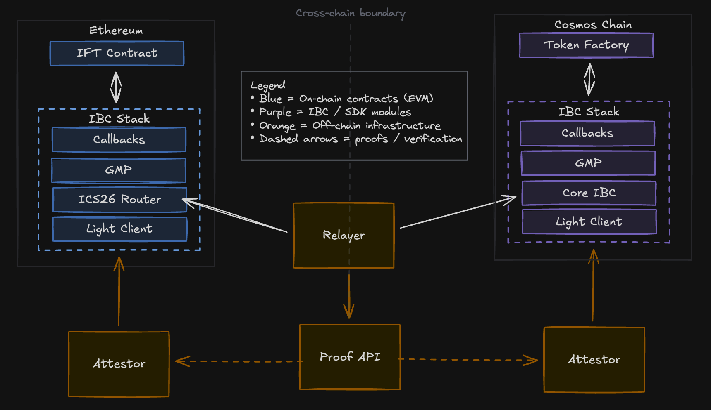

# IBC v2 Deployment Overview

This document explains how an IBC v2 deployment works end-to-end to support mint/burn transfers between Cosmos and EVM chains.

## System Architecture

Legend
- Blue = on-chain contracts (EVM)
- Purple = IBC / SDK modules, 
- Orange = off-chain infrastructure
- Dashed arrows = proofs / verification.

## Components

### **On-Chain**

**Cosmos Modules**
- Core IBC Modules
    - Description: Core IBC stack including the ICS 26 Router, ICS 26 Application Callbacks, and ICS 27 GMP.
    - Specifications: see [cosmos/ibc](https://github.com/cosmos/ibc/tree/main/spec/IBC_V2)
    - Implementations: see [cosmos/ibc-go](https://github.com/cosmos/ibc-go/tree/main/modules)
- Attestor Light Client 
    - Description: An attestor-based IBC light client that verifies IBC packets using quorum-signed ECDSA attestations from a fixed set of trusted signers, implemented in Go.
    - Specification: see [cosmos/ibc ics-026-application-callbacks](https://github.com/cosmos/ibc/tree/main/spec/IBC_V2/core/ics-026-application-callbacks)
    - Implementation: [cosmos/ibc-go attestor light client](https://github.com/cosmos/ibc-go/tree/main/modules/light-clients/attestations)
- Token Factory:
    - Description: Chain-dependent module that handles core asset logic and is configured with the IBC stack to initiate outgoing and/or process incoming IBC packets.

**EVM Contracts**
- Core IBC Contracts
    - Description: Core IBC contracts including the ICS 26 Router and ICS 27 GMP + Callbacks contracts.
    - Specifications: see [cosmos/ibc](https://github.com/cosmos/ibc/tree/main/spec/IBC_V2)
    - Implementations: see [cosmos/solidity-ibc-eureka](https://github.com/cosmos/solidity-ibc-eureka/tree/main/contracts).
- Attestor Light Client
    - Description: An attestor-based IBC light client that verifies IBC packets using quorum-signed ECDSA attestations from a fixed set of trusted signers, implemented in Solidity.
    - Specification: see [cosmos/solidity-ibc-eureka design](https://github.com/cosmos/solidity-ibc-eureka/blob/main/contracts/light-clients/attestation/IBC_ATTESTOR_DESIGN.md)
    - Implementation: see [cosmos/solidity-ibc-eureka attestation](https://github.com/cosmos/solidity-ibc-eureka/tree/main/contracts/light-clients/attestation)
- Interchain Fungible Token (IFT)
    - Description: A set of rules and interfaces for creating and managing fungible tokens that can be transferred across different blockchain networks using ICS-27 GMP.
    - Specification: see [IFT Specs](https://github.com/cosmos/ibc-attestor/docs/ift.md)
    - Implementation: see [cosmos/solidity-ibc-eureka IFTBase.sol](https://github.com/cosmos/solidity-ibc-eureka/blob/mariuszzak/ift/contracts/IFTBase.sol)

### **Off-Chain**

**Attestation Service**
- This repo: [cosmos/ibc-attestor](https://github.com/cosmos/ibc-attestor) (Rust service in `apps/ibc-attestor/`).

**Proof API**
- gRPC/Proof API: `proto/ibc_attestor/ibc_attestor.proto` defines `StateAttestation`, `PacketAttestation`, and `LatestHeight`.

**Relayer**
- Signature aggregation plus relaying lives in [cosmos/solidity-ibc-eureka](https://github.com/cosmos/solidity-ibc-eureka/tree/main/programs/relayer) with shared proof builders in `packages/relayer/`.
- The relayer queries the AttestationService, enforces quorum, assembles proofs, and submits them to both chains.

## Example IBC Transfer Flows

### Cosmos to EVM
1. The user or client submits a transaction on the Cosmos source chain which contains a burn/transfer message to the chain-dependent Token Factory module (interchangeable module that interfaces with IBC and handles core asset logic).
    - The Token Factory module calls the IBC GMP module to make a GMP call to the mint function on the EVM destination chain’s IFT contract.
    - The GMP module calls the core ibc module to send a packet with the GMP payload to the core IBC contract (ICS 26 Router) on the EVM destination chain.
    - The IBC modules emit the relevant packet information as an event.
    - The Attestor, which continuously monitors blocks for relevant IBC events, parses a valid IBC transfer packet based on its configuration and generates a signed attestation of the packet with associated blockchain state.
2. The client submits a request to the relayer service to relay the IBC transfer packet.
    - The relayer requests the data necessary to submit the IBC transaction and proof on the destination chain for packet delivery from the Proof API.
    - The Proof API:
        - Queries each Attestor configured for the given transfer path, 
        - Aggregates the signed attestations until the threshold is reached, 
        - Uses the aggregated signed attestations along with block data to generate the IBC RecvPacket data necessary to submit the transaction on chain, and
        - Responds back to the relayer with the relevant data.
3. The relayer takes the IBC RecvPacket transaction data and submits it to the EVM destination chain.
    - On the EVM destination chain, the ICS 26 Router contract parses the packet and executes core validation logic (sequencing, timeouts, etc), then routes it to the relevant light client contract.
    - The light client contract validates the IBC packet according to the light client’s validation rules.
    - Once a packet is validated by the light client contract, the ICS 26 Router routes the packet to the GMP contract.
    - The GMP contract parses/interprets the GMP payload, which encodes a call to the IFT contract mint function on the EVM destination chain and executes that call to the contract.
    - The IFT contract mints and transfers the token to the destination address specified in the GMP payload.

### EVM to Cosmos
1. The user or client submits a transaction on the EVM source chain which calls `iftTransfer` on the IFT contract to initiate an IBC transfer to a Cosmos destination chain.
    - The IFT contract burns the tokens from the sender and calls the ICS 27 GMP contract with the necessary information for an IBC mint/burn transfer packet.
    - The GMP contract calls the IBC Router contract to send a GMP call to mint the tokens on the Cosmos destination chain.
    - The IBC contracts emit the relevant packet information as an event.
    - The Attestor generates a signed attestation of the packet and associated blockchain state.
2. The client submits a request to the relayer service to relay the IBC transfer packet.
    - The relayer requests the data necessary to submit the IBC transaction and proof on the destination chain for packet delivery from the Proof API.
    - The Proof API:
        - Queries each Attestor configured for the given transfer path, 
        - Aggregates the signed attestations until the threshold is reached, 
        - Uses the aggregated signed attestations along with block data to generate the IBC RecvPacket data necessary to submit the transaction on chain, and
        - Responds back to the relayer with the relevant data.
3. The relayer takes the IBC RecvPacket transaction data and submits it to the EVM destination chain.
    - On the EVM destination chain, the core IBC modules parse the packet and execute core validation logic (sequencing, timeouts, etc), then routes it to the relevant light client module.
    - The light client module validates the IBC packet according to the light client’s validation rules.
    - Once a packet is validated by the light client module, the IBC Core modules route the packet to the GMP application module.
    - The GMP application module parses/interprets the GMP payload, which encodes a call to the Token Factory module on the Cosmos destination chain to mint tokens via hooks.
    - The Token Factory module mints and transfers the token to the destination address specified in the GMP payload.
