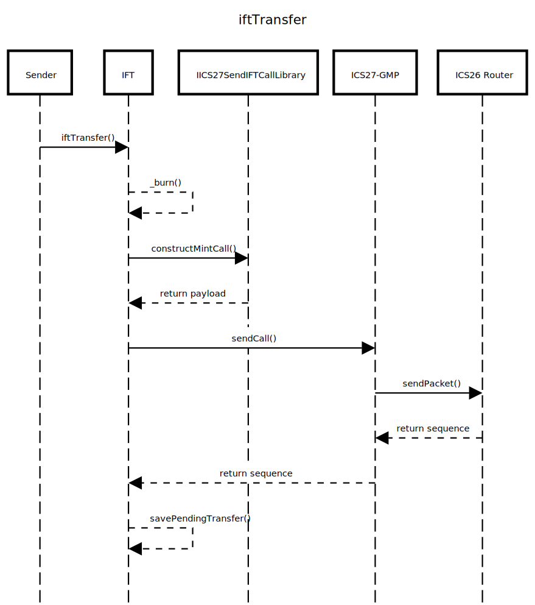
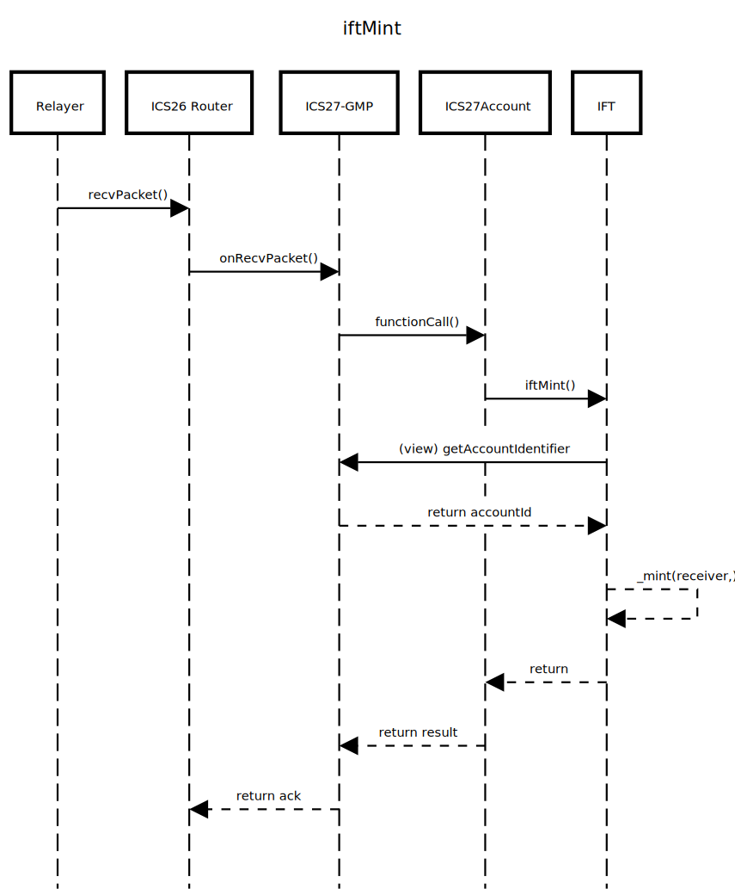

# IFT Specs

## Synopsis

This document specifies the Interchain Fungible Token (IFT) standard, which defines a set of rules and interfaces for creating and managing fungible tokens that can be transferred across different blockchain networks using ICS-27 (Interchain Accounts).

## Motivation

Blockchain developers and asset issuers developing on chains connected via IBC protocol might wish to create fungible tokens that can be seamlessly transferred across multiple chains via mint and burn mechanisms. Such issuers cannot always rely on ICS-20 tokens, as they may require more control over the token supply and behavior on each chain. The permissionless nature of ICS-20 may not align with the issuer's regulatory or business requirements.

## Desired Properties

- Extensibility: The IFT standard should allow for easy extension and customization to accommodate issuers' ownership models.
- Control via Contract Interactions: All actions must be accessible via ordinary contract interactions.

## Definitions

The IBC routing module interface are as defined in ICS 26.
The ICS-27 ICA standard is modified via the ICS27-GMP implementation which is not yet an ICS standard.

We define the following terms for the purposes of this specification:

- **Authority**: The asset issuer or governing body that has control over the IFT contracts on all chains.

## Technical Specifications

We assume IFT to be an extension of an existing fungible token standard on the respective chains (e.g., ERC20 for EVM-based chains, a token factory module for Cosmos SDK-based chains, etc.). This specification is written in the context of EVM-based chains using Solidity where each token is a smart contract implementing the ERC20 standard. When extending this specification to other environments, the following interfaces and structures should be adapted accordingly (e.g., per token denomination in Cosmos SDK).

### Data Structures

### `IFTBridge`

`IFTBridge` represents a counterparty IFT contract on a different chain connected via an IBC Light Client

```solidity
/// @notice IFTBridge represents a counterparty IFT contract on a different chain connected via an IBC Light Client
/// @param clientId The IBC client identifier on the local chain representing the counterparty chain
/// @param counterpartyIFTAddress The address of the IFT contract on the counterparty chain. (e.g., an ERC20 contract address, or token factory module address in Cosmos SDK)
/// @param iftSendCallConstructor The address of the IFTSendCall library to use for constructing the mint call for the counterparty chain, this differs per chain type and should be set during bridge registration
struct IFTBridge {
    string clientId;
    string counterpartyIFTAddress;
    IIFTSendCallConstructor iftSendCallConstructor;
}

```

### `IICS27SendIFTCallConstructor`

`IIFTSendCallConstructor` defines the interface for constructing ICS27-GMP call data for minting IFT tokens on the counterparty chain

In a non-solidity implementation, this would be a function for constructing the mint call data for the counterparty chain.
I provide two example implementations in the [appendix](https://www.notion.so/IFT-Specs-2be8c17818cb805984c5c9bae779dfe6?pvs=21): one for EVM-based chains and one for Cosmos SDK-based chains.

```solidity
/// @notice IIFTSendCallConstructor defines the interface for constructing ICS27-GMP call data for minting IFT tokens on the counterparty chain
/// @dev Simplest implementations may be stateless libraries with pure functions, while more complex implementations may require state (e.g., storing denom for Cosmos SDK chains)
interface IIFTSendCallConstructor {
    /// @notice constructMintCall constructs the ICS27-GMP call data for minting IFT tokens on the counterparty chain
    /// @dev This function is called during the iftTransfer process to create the message to be sent via ICS27-GMP
    /// @dev The constructed call data should conform to the expected format of the counterparty IFT contract's mint function
    /// @dev For example, in an EVM-based chain, this would be an encoded function call, while in a Cosmos SDK-based chain, this would be a protojson-encoded message
    /// @dev If the function requires additional parameters (e.g., denom for Cosmos SDK), those should be included in the constructor of the implementing contract
    /// @param receiver The address of the receiver on the counterparty chain
    /// @param amount The amount of tokens to mint
    /// @return The constructed call data for the ICS27-GMP message
    function constructMintCall(string calldata receiver, uint256 amount) external view returns (bytes memory);
}

```

### `PendingTransfer`

PendingTransfer represents a transfer that has been initiated but not yet completed

```solidity
/// @notice PendingTransfer represents a transfer that has been initiated but not yet completed
/// @dev This structure is used to refund tokens in case of transfer failure
/// @param clientId The IBC client identifier over which the transfer is being made
/// @param sequence The IBC sequence number associated with the ibc packet
/// @param sender The address of the sender who initiated the transfer
/// @param amount The amount of tokens involved in the pending transfer
struct PendingTransfer {
    string clientId;
    uint64 sequence;
    address sender;
    uint256 amount;
}

```

### `IFTStorage`

`IFTStorage` is the state storage layout for the IFT contract.

```solidity
/// @notice IFTStorage is the state storage layout for the IFT contract.
/// @param ics27Gmp The ICS27-GMP module interface for sending and receiving generalized messages over IBC
/// @param iftBridges A mapping from IBC client identifiers to IFTBridge structures
/// @param pendingTransfers A mapping from (clientId, sequence) pairs to PendingTransfer structures
struct IFTStorage {
    IICS27GMP ics27Gmp;
    mapping(string clientId => IFTBridge bridge) iftBridges;
    mapping(string clientId => mapping(uint64 seq => PendingTransfer info)) pendingTransfers;
}

```

### Query Methods

### `getIFTBridge`

`getIFTBridge` retrieves the IBC bridge information for a given IBC client identifier

```solidity
/// @notice getIFTBridge retrieves the IBC bridge information for a given IBC client identifier
/// @param clientId The IBC client identifier on the local chain representing the counterparty chain
/// @return The IFTBridge structure associated with the given clientId
function getIFTBridge(string memory clientId) external view returns (IFTBridge memory) {
    IFTStorage storage $ = _getIFTStorage();
    return $.iftBridges[clientId];
};

```

### `getPendingTransfer`

`getPendingTransfer` retrieves the pending transfer information

```solidity
/// @notice getPendingTransfer retrieves the pending transfer information
/// @param clientId The IBC client identifier over which the transfer is being made
/// @param sequence The IBC sequence number associated with the ibc packet
/// @return The PendingTransfer structure associated with the given clientId and sequence
function getPendingTransfer(string memory clientId, uint64 sequence) external view returns (PendingTransfer memory) {
    IFTStorage storage $ = _getIFTStorage();
    return $.pendingTransfers[clientId][sequence];
};

```

### `ics27`

`ics27` retrieves the ICS27-GMP module interface

```solidity
/// @notice ics27 retrieves the ICS27-GMP module interface
/// @return The address of the ICS27-GMP module interface
function ics27() external view returns (IICS27GMP) {
    IFTStorage storage $ = _getIFTStorage();
    return $.ics27Gmp;
};

```

### Events

### `IFTBridgeRegistered`

`IFTBridgeRegistered` is emitted when a new IBC bridge is registered

```solidity
/// @notice IFTBridgeRegistered is emitted when a new IBC bridge is registered
/// @param clientId The IBC client identifier on the local chain representing the counterparty chain
/// @param counterpartyIFTAddress The address of the IFT contract on the counterparty chain
/// @param iftSendCallConstructor The address of the IFTSendCall library used for constructing the mint call for the counterparty chain
event IFTBridgeRegistered(string clientId, string counterpartyIFTAddress, address iftSendCallConstructor);

```

### `IFTTransferInitiated`

`IFTTransferInitiated` is emitted when a bridge transfer is initiated

```solidity
/// @notice IFTTransferInitiated is emitted when a bridge transfer is initiated
/// @param clientId The IBC client identifier over which the transfer is being made
/// @param sequence The IBC sequence number associated with the ibc packet
/// @param sender The address of the sender who initiated the transfer
/// @param receiver The address of the receiver on the counterparty chain
/// @param amount The amount of tokens involved in the transfer
event IFTTransferInitiated(string clientId, uint64 sequence, address sender, string receiver, uint256 amount);

```

### `IFTMintReceived`

`IFTMintReceived` is emitted when tokens are minted on the local chain in response to an IFT transfer from a counterparty chain

```solidity
/// @notice IFTMintReceived is emitted when tokens are minted on the local chain in response to an IFT transfer from a counterparty chain
/// @param clientId The IBC client identifier over which the transfer is being made
/// @param receiver The address of the receiver on the local chain
/// @param amount The amount of tokens minted
event IFTMintReceived(string clientId, address receiver, uint256 amount);

```

### `IFTTransferCompleted`

`IFTTransferCompleted` is emitted when a bridge transfer is successfully completed

```solidity
/// @notice IFTTransferCompleted is emitted when a bridge transfer is successfully completed
/// @param clientId The IBC client identifier over which the transfer was made
/// @param sequence The IBC sequence number associated with the ibc packet
/// @param sender The address of the sender who initiated the transfer
/// @param amount The amount of tokens transferred
event IFTTransferCompleted(string clientId, uint64 sequence, address sender, uint256 amount);

```

### `IFTTransferRefunded`

`IFTTransferRefunded` is emitted when a bridge transfer is refunded due to failure

```solidity
/// @notice IFTTransferRefunded is emitted when a bridge transfer is refunded due to failure
/// @param clientId The IBC client identifier over which the transfer was made
/// @param sequence The IBC sequence number associated with the ibc packet
/// @param sender The address of the sender who initiated the transfer
/// @param amount The amount of tokens refunded to the sender
event IFTTransferRefunded(string clientId, uint64 sequence, address sender, uint256 amount);

```

### External Methods

Below methods are implemented with pseudocode to make the specification clearer.

### `registerIFTBridge`

`registerIFTBridge` registers a new IBC bridge to a counterparty IFT contract on another chain

```solidity
/// @notice registerIFTBridge registers a new IBC bridge to a counterparty IFT contract on another chain
/// @dev MUST only be callable by the authority
/// @dev The counterparty IFT contract must also register the bridge to this contract before transfers can succeed
/// @param clientId The IBC client identifier on the local chain representing the counterparty chain
/// @param counterpartyIFTAddress The address of the IFT contract on the counterparty chain
/// @param iftSendCallConstructor The address of the IFTSendCall library to use for constructing the mint call for the counterparty chain
function registerIFTBridge(string calldata clientId, string calldata counterpartyIFTAddress, address iftSendCallConstructor) external {
    _onlyAuthority();

    IFTStorage storage $ = _getIFTStorage();
    $.iftBridges[clientId] = IFTBridge({
        clientId: clientId,
        counterpartyIFTAddress: counterpartyIFTAddress,
        iftSendCallConstructor: IIFTSendCallConstructor(iftSendCallConstructor)
    });

    emit IFTBridgeRegistered(clientId, counterpartyIFTAddress, iftSendCallConstructor);
};

```

### `iftTransfer`

`iftTransfer` initiates a transfer of tokens to a counterparty chain via IBC. A sequence diagram is provided in the [sequence diagrams](https://www.notion.so/IFT-Specs-2be8c17818cb805984c5c9bae779dfe6?pvs=21) section.

```solidity
/// @notice iftTransfer initiates a transfer of tokens to a counterparty chain via IBC
/// @param clientId The IBC client identifier over which the transfer is being made
/// @param receiver The address of the receiver on the counterparty chain
/// @param amount The amount of tokens to transfer
/// @param timeoutTimestamp The timeout timestamp for the IBC packet
function iftTransfer(string calldata clientId, string calldata receiver, uint256 amount, uint64 timeoutTimestamp) external {
    require(bytes(clientId).length > 0, "IFT: clientId cannot be empty");
    require(bytes(receiver).length > 0, "IFT: receiver cannot be empty");
    require(amount > 0, "IFT: amount must be greater than zero");

    _burn(_msgSender(), amount); // Assuming _burn is defined in the underlying fungible token standard

    IFTStorage storage $ = _getIFTStorage();
    IFTBridge memory bridge = $.iftBridges[clientId];
    require(bridge.clientId == clientId); // Redundant check for clarity

    bytes memory payload = bridge.iftSendCallConstructor.constructMintCall(receiver, amount);
    uint64 seq = $.ics27Gmp.sendCall(
        IICS27GMPMsgs.SendCallMsg({
            sourceClient: bridge.clientId,
            receiver: bridge.counterpartyIFTAddress,
            salt: "",
            payload: payload,
            timeoutTimestamp: timeoutTimestamp,
            memo: ""
        })
    );

    $.pendingTransfers[bridge.clientId][seq] = PendingTransfer({
        clientId: bridge.clientId,
        sequence: seq,
        sender: _msgSender(),
        amount: amount
    });

    emit IFTTransferInitiated(bridge.clientId, seq, _msgSender(), receiver, amount);
};

/// @notice iftTransfer initiates a transfer of tokens to a counterparty chain via IBC with default timeout
/// @param clientId The IBC client identifier over which the transfer is being made
/// @param receiver The address of the receiver on the counterparty chain
/// @param amount The amount of tokens to transfer
function iftTransfer(string calldata clientId, string calldata receiver, uint256 amount) external {
    // Default timeout of 15 minutes from now
    uint64 timeoutTimestamp = uint64(block.timestamp + 15 minutes);
    iftTransfer(clientId, receiver, amount, timeoutTimestamp);
};

```

### `iftMint`

`iftMint` mints tokens on the local chain in response to an IFT transfer from a counterparty chain. A sequence diagram is provided in the [sequence diagrams](https://www.notion.so/IFT-Specs-2be8c17818cb805984c5c9bae779dfe6?pvs=21) section.

```solidity
/// @notice iftMint mints tokens on the local chain in response to an IFT transfer from a counterparty chain
/// @dev MUST only be callable by a ICS27-GMP account controlled by a counterparty bridge
/// @param receiver The address of the receiver on the local chain
/// @param amount The amount of tokens to mint
function iftMint(address receiver, uint256 amount) external {
    IFTStorage storage $ = _getIFTStorage();
    ICS27GMPMsgs.AccountIdentifier memory accountId = $.ics27Gmp.getAccountIdentifier(_msgSender()); // account reflection in ICS27-GMP
    IFTBridge memory bridge = $.iftBridges[accountId.clientId];

    require(bridge.clientId == accountId.clientId); // Redundant check for clarity
    require(bridge.counterpartyIFTAddress == accountId.sender, "IFT: unauthorized sender");
    require(accountId.salt.length == 0, "IFT: unexpected salt");

    _mint(receiver, amount); // Assuming _mint is defined in the underlying fungible token standard

    emit IFTMintReceived(bridge.clientId, receiver, amount);
};

```

### Internal Methods

### `_refundPendingTransfer`

`_refundPendingTransfer` refunds a pending transfer back to the sender and deletes the pending transfer record

```solidity
/// @notice _refundPendingTransfer refunds a pending transfer back to the sender and deletes the pending transfer record
/// @param clientId The IBC client identifier over which the transfer is being made
/// @param sequence The IBC sequence number associated with the ibc packet
function _refundPendingTransfer(string memory clientId, uint64 sequence) internal {
    IFTStorage storage $ = _getIFTStorage();
    PendingTransfer memory pending = $.pendingTransfers[clientId][sequence];
    require(pending.clientId == clientId, "IFT: clientId mismatch");
    require(pending.sequence == sequence, "IFT: sequence mismatch");
    require(pending.amount > 0, "IFT: no pending transfer found");

    _mint(pending.sender, pending.amount); // Assuming _mint is defined in the underlying fungible token standard
    delete $.pendingTransfers[clientId][sequence];

    emit IFTTransferRefunded(clientId, sequence, pending.sender, pending.amount);
}

```

### IBC Sender Callbacks

IBC sender callbacks are invoked by the ICS27-GMP module upon success or failure of the IBC packet in the solidity implementation. In Cosmos SDK implementations, similar logic should be implemented by using the callbacks middleware.

### `onTimeoutPacket`

```solidity
/// @inheritdoc IIBCSenderCallbacks
function onTimeoutPacket(IIBCAppCallbacks.OnTimeoutPacketCallback calldata msg_) external onlyICS27 {
    _onlyICS27GMP(); // Ensure only ICS27-GMP can call this function

    _refundPendingTransfer(msg_.sourceClient, msg_.sequence);
}

```

### `onAckPacket`

```solidity
/// @inheritdoc IIBCSenderCallbacks
function onAckPacket(
    bool success,
    IIBCAppCallbacks.OnAcknowledgementPacketCallback calldata msg_
)
    external
{
    _onlyICS27GMP(); // Ensure only ICS27-GMP can call this function

    if (!success) {
        _refundPendingTransfer(msg_.sourceClient, msg_.sequence);
        return;
    }

    IFTStorage storage $ = _getIFTStorage();
    delete $.pendingTransfers[msg_.clientId][msg_.sequence];

    emit IFTTransferCompleted(msg_.clientId, msg_.sequence, msg_.sender, msg_.amount);
}

```

## Sequence Diagrams

### iftTransfer Diagram



### iftMint Diagram



## Appendix

### Example `IIFTSendCallConstructor` Implementations

### EVM-based Chain Implementation

```solidity
/// @notice EVMIFTSendCallConstructor is an implementation of IIFTSendCallConstructor for EVM-based chains
contract EVMIFTSendCallConstructor is IIFTSendCallConstructor {
    /// @inheritdoc IIFTSendCallConstructor
    function constructMintCall(string calldata receiver, uint256 amount) external pure override returns (bytes memory) {
        return abi.encodeCall(IIFT.mint, (receiver, amount));
    }
}

```

### Cosmos SDK-based Chain Implementation

```solidity
/// @notice CosmosSDKIFTSendCallConstructor is an implementation of IIFTSendCallConstructor for Cosmos SDK-based chains
/// @dev This implementation is an example, and may need to be adapted based on the actual message structure of the TokenFactory module
contract CosmosSDKIFTSendCallConstructor is IIFTSendCallConstructor {
    /// @notice BRIDGE_RECEIVE_TYPE_URL is the type URL for the MsgIFTMint message in the TokenFactory module.
    string private constant BRIDGE_RECEIVE_TYPE_URL = "/examplechain.tokenfactory.MsgIFTMint";

    /// @notice DENOM is the denomination of the counterparty token on the Cosmos SDK chain.
    string public immutable DENOM;

    /// @notice icaAddress is the interchain account address of the submitter account on the Cosmos SDK chain.
    /// @dev This is required to set the signer of the MsgBridgeReceive message, a limitation of the Cosmos SDK is that
    ///      the signer address must be known at message construction time.
    string public icaAddress;

    /// @notice The constructor sets the denom and interchain account address.
    constructor(string calldata denom, string calldata icaAddress_) {
        DENOM = denom;
        icaAddress = icaAddress_;
    }

    /// @inheritdoc IIFTSendCallConstructor
    function constructMintCall(string calldata receiver, uint256 amount) external pure returns (bytes memory) {
        return abi.encodePacked(
            "{\\"@type\\":\\"",
            BRIDGE_RECEIVE_TYPE_URL,
            "\\",\\"ica_address\\":\\"",
            icaAddress,
            "\\",\\"receiver\\":\\"",
            receiver,
            "\\",\\"amount\\":{\\"denom\\":\\"",
            denom,
            "\\",\\"amount\\":\\"",
            Strings.toString(amount),
            "\\"}}"
        );
    }
}

```

## Cosmos SDK Integration

This section describes how to integrate the IFT standard with Cosmos SDK–based chains that provide a token factory–style module (per-denom mint/burn). Instead of a per-token smart contract (like ERC20 on EVM), IFTs on Cosmos are represented as denominations managed by a token factory module.

### Requirements

In Cosmos SDK chains,

- The chain **MUST** run ICS27-GMP for generalized message passing.
- There **MUST** be an existing token factory module that implements privilaged methods for minting and burning of intended denoms to intended addresses.
- IFT handlers **MAY** be implemented in an ift module that calls into the token factory or **MAY** be implemented in the token factory module itself.

For example,

```go
type TokenFactoryKeeper interface {
    // MintTo mints new tokens of `denom` into `address`.
    // MUST fail if `denom` is not recognized or not authorized for minting.
    MintTo(ctx sdk.Context, denom string, amount sdk.Int, address sdk.AccAddress) error

    // BurnFrom burns tokens of `denom` from `address`.
    // MUST fail if `address` does not have enough balance or burn is not permitted.
    BurnFrom(ctx sdk.Context, denom string, amount sdk.Int, addr sdk.AccAddress) error
}

```

### IFT Internal Methods

### `IsAuthority`

`IsAuthority(ctx, address)` checks if the given address is the authority allowed to register bridges.

### `SetIFTBridge`

`SetIFTBridge(ctx, denom, clientID, IFTBridge)` saves the IFTBridge information in the store for the given denom and clientID.

### `GetIFTBridge`

The getter for IFTBridge information per denom and clientID.

### `RemoveIFTBridge`

`RemoveIFTBridge(ctx, denom, clientID)` removes the IFTBridge information from the store.

### `SetPendingTransfer`

`SetPendingTransfer(ctx, clientID, sequence, PendingTransfer)` saves the pending transfer information in the store.

> [!NOTE]
In Cosmos SDK, the PendingTransfer structure would also need to include the denom field to identify which token denomination the pending transfer is for.
> 

### `GetPendingTransfer`

The getter for PendingTransfer information per denom, clientID, and sequence.

### `RemovePendingTransfer`

`RemovePendingTransfer(ctx, clientID, sequence)` removes the pending transfer information from the store.

### `constructMintCall`

The `constructMintCall(receiver, amount, iftSendCallConstructor) ([]byte, error)` method MUST take the `ift_send_call_constructor` string and construct the mint call data accordingly. For example, if the constructor is `"solidity"`, it would create an abi-encoded `iftMint` call.

### `refundPendingTransfer`

`refundPendingTransfer(ctx, clientID, sequence)` refunds the pending transfer back to the sender and deletes the pending transfer record.

```go
func (k Keeper) refundPendingTransfer(ctx sdk.Context, clientID string, sequence uint64) error {
    pending, found := k.GetPendingTransfer(ctx, clientID, sequence)
    abortTxUnless(found);
    abortTxUnless(validate(pending));

    err := k.tokenFactoryHandler.MintTo(ctx, pending.Denom, pending.Amount, pending.Sender)
    abortTxUnless(err == nil);

    k.RemovePendingTransfer(ctx, clientID, sequence);
    emit(IFTTransferRefundedEvent{...});
    return nil;
}

```

### IFT Handlers

### `RegisterIFTBridge`

This is the Cosmos SDK equivalent of `registerIFTBridge` modified to work with the token factory module of Cosmos SDK chains.

```protobuf
message MsgRegisterIFTBridge {
    // The address of the signer registering the bridge (must be authority)
    string signer = 1;
    // The denom representing the IFT token on this chain
    string denom = 2;
    // The IBC client identifier on the local chain representing the counterparty chain
    string client_id = 3;
    // The address of the IFT on the counterparty chain
    string counterparty_ift_address = 4;
    // The identifier of the IFTSendCall constructor to use for constructing the mint call for the counterparty chain
    //
    // Implementation detail: this could be a type URL, JSON object, or just a name
    // used to look up a concrete constructor object. For example, `"solidity"`.
    string ift_send_call_constructor = 5;
}

```

The handler is implemented as follows, validations are as in the solidity pseudocode:

```go
func (k Keeper) RegisterIFTBridge(ctx sdk.Context, msg MsgRegisterIFTBridge) error {
    // Only authority can register bridges
    abortTxUnless(k.IsAuthority(ctx, msg.Signer));
    // Validate input, e.g., non-empty client ID, valid denom, etc.
    abortTxUnless(validate(msg));
    // Save the IFTBridge information in the store
    bridge := IFTBridge{
        ClientId: msg.ClientId,
        CounterpartyIFTAddress: msg.CounterpartyIftAddress,
        IFTSendCallConstructor: msg.IftSendCallConstructor,
    }
    k.SetIFTBridge(ctx, msg.Denom, msg.ClientId, bridge);

    emit(IFTBridgeRegisteredEvent{...});
    return nil;
}

```

### `IFTTransfer`

This is the Cosmos SDK equivalent of `iftTransfer` modified to work with the token factory module of Cosmos SDK chains.

```protobuf
message MsgIFTTransfer {
    // The address of the signer initiating the transfer
    string signer = 1;
    // The denom representing the IFT token on this chain
    string denom = 2;
    // The IBC client identifier over which the transfer is being made
    string client_id = 3;
    // The address of the receiver on the counterparty chain
    string receiver = 4;
    // The amount of tokens to transfer
    string amount = 5;
    // The timeout timestamp for the IBC packet (in seconds since epoch)
    uint64 timeout_timestamp = 6;
}

```

The handler is implemented as follows, and validations are as in the solidity pseudocode:

```go
func (k Keeper) IFTTransfer(ctx sdk.Context, msg MsgIFTTransfer) error {
    // Validate input, e.g., non-empty client ID, valid denom, positive amount, etc.
    abortTxUnless(validate(msg));
    // Burn tokens from sender
    k.tokenFactoryHandler.BurnFrom(ctx, msg.Denom, msg.Amount, msg.Signer);
    // Get the IFTBridge information
    bridge, found := k.GetIFTBridge(ctx, msg.Denom, msg.ClientId);
    abortTxUnless(found);
    abortTxUnless(validate(bridge));
    // Construct the mint call data
    payload, err := constructMintCall(msg.Receiver, msg.Amount, bridge.IFTSendCallConstructor);
    abortTxUnless(err == nil);
    // Send the ICS27-GMP call
    seq, err := k.ICS27GMPHandler.SendCall(ctx, ...);
    abortTxUnless(err == nil);
    // Save the pending transfer information
    pending := PendingTransfer{
        ClientId: msg.ClientId,
        Sequence: seq,
        Sender: msg.Signer,
        Amount: msg.Amount,
    }
    k.SetPendingTransfer(ctx, msg.Denom, msg.ClientId, seq, pending);
    emit(IFTTransferInitiatedEvent{...});
    return nil;
}

```

### `IFTMint`

This is the Cosmos SDK equivalent of `iftMint` modified to work with the token factory module of Cosmos SDK chains.

```protobuf
message MsgIFTMint {
    // The address of the signer (must be ICS27-GMP account controlled by a counterparty bridge)
    string signer = 1;
    // The denom representing the IFT token on this chain
    string denom = 2;
    // The address of the receiver on the local chain
    string receiver = 3;
    // The amount of tokens to mint
    string amount = 4;
}

```

The handler is implemented as follows, and validations are as in the solidity pseudocode:

```go
func (k Keeper) IFTMint(ctx sdk.Context, msg MsgIFTMint) error {
    // Get the ICS27-GMP account identifier
    accountId, err := k.ICS27GMPHandler.GetAccountIdentifier(ctx, msg.Signer);
    abortTxUnless(err == nil);
    // Get the IFTBridge information
    bridge, found := k.GetIFTBridge(ctx, msg.Denom, accountId.ClientId);
    abortTxUnless(found);
    // Validate the sender
    abortTxUnless(bridge.CounterpartyIFTAddress == accountId.Sender);
    // Mint tokens to receiver
    k.tokenFactoryHandler.MintTo(ctx, msg.Denom, msg.Amount, msg.Receiver);
    emit(IFTMintReceivedEvent{...});
    return nil;
}

```

### IBC Sender Callbacks

IBC sender callbacks are required to handle timeouts and acknowledgments of IBC packets. These callbacks are invoked by the callbacks middleware in the Cosmos SDK implementation of ICS27-GMP.

Therefore, the IFT handler module **MUST** implement the [`ContractKeeper` interface](https://github.com/cosmos/ibc-go/blob/ed3b125c7b6fb7cbb6f9535d62f4c19f572a0c53/modules/apps/callbacks/types/expected_keepers.go#L12-L100). Note that unlike other IBC modules, the ICS27-GMP sender callbacks do not require any special memo field to be set.

### [`IBCSendPacketCallback`](https://github.com/cosmos/ibc-go/blob/ed3b125c7b6fb7cbb6f9535d62f4c19f572a0c53/modules/apps/callbacks/types/expected_keepers.go#L29)

This is a no-op for IFT as no special handling is needed when sending packets.

```go
func (k Keeper) IBCSendPacketCallback(ctx sdk.Context, ... ) error {
    // No-op for IFT
    return nil;
}

```

### [`IBCOnAcknowledgementPacketCallback`](https://github.com/cosmos/ibc-go/blob/ed3b125c7b6fb7cbb6f9535d62f4c19f572a0c53/modules/apps/callbacks/types/expected_keepers.go#L54)

In IBC-Go, the callbacks middleware uses the ibc v1 interfaces for packet callbacks. As such, the `IBCOnAcknowledgementPacketCallback` method signature differs slightly from the solidity pseudocode and the validation logic is adapted accordingly.

```go
func (k Keeper) IBCOnAcknowledgementPacketCallback(ctx, packet, packetSenderAddress, contractAddress, acknowledgement, ... ) error {
    require(contractAddress == k.SelfModuleAddress(), ValidationError);
    require(packetSenderAddress == k.SelfModuleAddress(), ValidationError);
    require(version == ICS27GMPVersion, ValidationError);
    require(packet.SourcePort == ICS27GMPPortID, ValidationError);
    require(packet.DestinationPort == ICS27GMPPortID, ValidationError);

    if acknowledgement == channeltypesv2.ErrorAcknowledgement {
        return k.refundPendingTransfer(ctx, packet.SourceChannel, packet.Sequence);
    }

    k.RemovePendingTransfer(ctx, packet.SourceChannel, packet.Sequence);
    emit(IFTTransferCompletedEvent{...});

    return nil
}

```

### [`IBCOnTimeoutPacketCallback`](https://github.com/cosmos/ibc-go/blob/ed3b125c7b6fb7cbb6f9535d62f4c19f572a0c53/modules/apps/callbacks/types/expected_keepers.go#L77)

In IBC-Go, the callbacks middleware uses the ibc v1 interfaces for packet callbacks. As such, the `IBCOnTimeoutPacketCallback` method signature differs slightly from the solidity pseudocode and the validation logic is adapted accordingly.

```go
func (k Keeper) IBCOnTimeoutPacketCallback(ctx, packet, contractAddress,packetSenderAddress, version, ...) error {
    require(contractAddress == k.SelfModuleAddress(), ValidationError);
    require(packetSenderAddress == k.SelfModuleAddress(), ValidationError);
    require(version == ICS27GMPVersion, ValidationError);
    require(packet.SourcePort == ICS27GMPPortID, ValidationError);
    require(packet.DestinationPort == ICS27GMPPortID, ValidationError);

    return k.refundPendingTransfer(ctx, packet.SourceChannel, packet.Sequence);
}

```

### [`IBCReceivePacketCallback`](https://github.com/cosmos/ibc-go/blob/ed3b125c7b6fb7cbb6f9535d62f4c19f572a0c53/modules/apps/callbacks/types/expected_keepers.go#L93)

This is not supported for IFT as all receiving logic is handled via the `IFTMint` handler called by ICS27-GMP.

```go
func (k Keeper) IBCReceivePacketCallback(ctx sdk.Context, ...) error {
    return ErrNotSupported;
}
```
