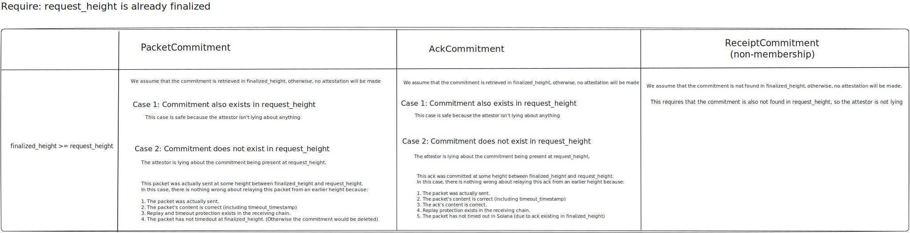

# Summary

During an internal audit we found that the Solana attestation service can only validate the existance of packets at the latest finalized height. This is different to the EVM and Cosmos services which are able to do historicy proofs.

## Decision

We deemed that this does not pose any security threats to users of the service. In the image we show that each packet kind is secure even in the case where the packet was submitted at a height later than the request height.

 
