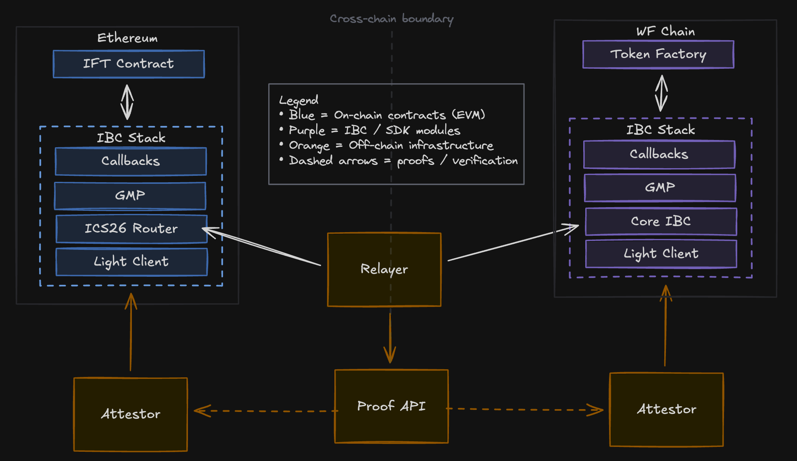

# IBC v2 Deployment Overview

This document explains how an IBC v2 deployment works end-to-end to support mint/burn transfers between Cosmos and EVM chains.

## System Architecture

Legend
- Blue = on-chain contracts (EVM)
- Purple = IBC / SDK modules, 
- Orange = off-chain infrastructure
- Dashed arrows = proofs / verification.

## Components

### **On-Chain**

**Modules**
- Core IBC and GMP modules use ibc-go: [cosmos/ibc-go](https://github.com/cosmos/ibc-go/tree/main/modules) (core stack, ICS26 router, ICS27/ICA for GMP, callbacks middleware).
- Attestor light client for Cosmos SDK chains: [cosmos/ibc-go attestor light client](https://github.com/cosmos/ibc-go/tree/main/modules/light-clients/attestations).
- Token Factory (chain application layer) consumes IBC packets for mint/burn; it sits above the ibc-go stack on the Cosmos chain.

**Contracts**
- IBC stack (ICS26 router, callbacks, GMP, storage) and application contracts (e.g., IFT/token logic) are in [cosmos/solidity-ibc-eureka](https://github.com/cosmos/solidity-ibc-eureka/tree/main/contracts).
- Attestor light client for EVM lives in [cosmos/solidity-ibc-eureka](https://github.com/cosmos/solidity-ibc-eureka/tree/main/packages/attestor/light-client) and the Solidity light-client interfaces in `contracts/light-clients/`.

### **Off-Chain**

**Attestation Service**
- This repo: [cosmos/ibc-attestor](https://github.com/cosmos/ibc-attestor) (Rust service in `apps/ibc-attestor/`).

**Proof API**
- gRPC/Proof API: `proto/ibc_attestor/ibc_attestor.proto` defines `StateAttestation`, `PacketAttestation`, and `LatestHeight`.

**Relayer**
- Signature aggregation plus relaying lives in [cosmos/solidity-ibc-eureka](https://github.com/cosmos/solidity-ibc-eureka/tree/main/programs/relayer) with shared proof builders in `packages/relayer/`.
- The relayer queries the AttestationService, enforces quorum, assembles proofs, and submits them to both chains.

## Example IBC Transfer Flows

### Cosmos to EVM
1. The user or client submits a transaction on the Cosmos source chain which contains a burn/transfer message to the chain-dependent Token Factory module (interchangeable module that interfaces with IBC and handles core asset logic).
    a. The Token Factory module calls the IBC GMP module to make a GMP call to the mint function on the EVM destination chain’sIFT contract.
    - The GMP module calls the core ibc module to send a packet with the GMP payload to the core IBC contract (ICS 26 Router) on the EVM destination chain.
    - The IBC modules emit the relevant packet information as an event.
    - The Attestor, which continuously monitors blocks for relevant IBC events parses a valid IBC transfer packet based on its configuration, and generates a signed attestation of the packet and associated blockchain state.
2. The client submits a request to the relayer service to relay the IBC transfer packet.
    - The relayer requests the data necessary to submit the IBC transaction and proof on the destination chain for packet delivery from the Proof API.
    - The Proof API:
        - Queries each Attestor configured for the given transfer path, 
        - Aggregates the signed attestations until the threshold is reached, 
        - Uses the aggregated signed attestations along with block data to generate the necessary IBC receive data necessary to submit the transaction on chain, and
        - Responds back to the relayer with the relevant data.
3. The relayer takes the IBC receive transaction data and submits it to the EVM destination chain.
    - On the EVM destination chain, the ICS 26 Router contract parses the packet and executes core validation logic (sequencing, timeouts, etc), then routes it to the relevant light client contract.
    - The light client contract validates the IBC packet according to the light client’s validation rules.
    - Once a packet is validated by the light client contract, the ICS 26 Router routes the packet to the GMP contract.
    - The GMP contract parses/interprets the GMP payload, which encodes a call to the IFT contract mint function on the EVM destination chain and executes that call to the contract.
    - The IFT contract mints and transfers the token to the destination address specified in the GMP payload.
